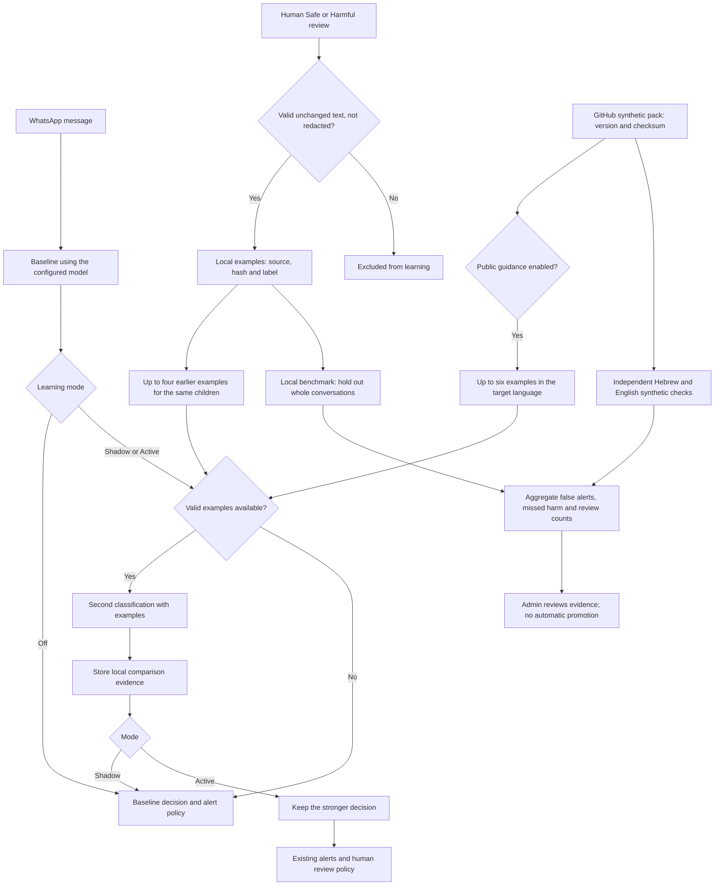
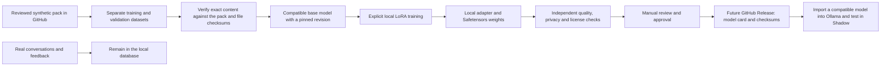

# Iris learning flow and logic

Iris learns from feedback by supplying reviewed examples as context to Ollama.
Updating model weights is a separate, explicit workflow outside the application.
There is no claim that the model is smarter than users: evaluations compare harm
detection and false alerts against the existing baseline.

## Runtime learning flow



## Decision rules

1. Accepted Safe/Harmful reviews automatically capture eligible text. Ignore,
   missing-data reports, media, and deleted, edited or redacted sources are excluded.
2. Private retrieval uses earlier examples for exactly the same set of monitored
   children. A target cannot retrieve itself. Deleting a source deletes its attached example.
3. The public pack contains independently authored synthetic examples. It is never
   generated from user conversations or feedback. It ships with Iris releases; the runtime
   does not fetch or execute code from GitHub.
4. Shadow records comparisons while leaving alerts on the baseline. Active can escalate
   a decision but cannot clear a stronger baseline decision. Off disables additional inference.
5. The local benchmark holds out one fifth of conversations using a stable split, excluding
   every held-out conversation from example retrieval. Only aggregate results are reported.
   Human feedback is the evaluation reference, not an infallible ground truth.
6. The evaluation gate requires at least 100 held-out labels, including 30 safe and 30 harmful,
   no failed requests, no additional false alerts or missed harm, precision and harm detection
   of at least 95%, and improvement over the baseline. These are initial screening rules,
   not statistical proof or permission to publish weights. Synthetic checks alone never
   qualify. There is no automatic switch to Active.

## Sharing consent

**Sharing is off by default.** The account menu contains **Learning sharing consent**.
Consent is saved per account with explicit policy acknowledgement, an update timestamp,
and the option to withdraw. An administrator cannot approve on another user's behalf.
Receiving the public pack does not grant permission to contribute data back.

No automatic uploader currently exists. Consent is a prerequisite for any future contribution
workflow and does not permit exporting messages, contacts or private reviews. Publishing
development code and independently authored synthetic examples does not publish user data
or change any user's consent.

## Optional weight training and release workflow



Preparation and validation do not download models or access the Iris database:

```powershell
python scripts/prepare_learning_model.py --base-model <compatible-model-id> --revision <pinned-commit>
python scripts/train_learning_adapter.py --dataset .local/learning-training
```

Training requires an explicit command in a separate environment with PyTorch,
Transformers, PEFT and Accelerate:

```powershell
python -m pip install -r scripts/learning-training-requirements.txt
python scripts/train_learning_adapter.py --dataset .local/learning-training --train
```

The default uses an already installed base model. `--allow-download` explicitly permits
downloads. A quantized Ollama model is not necessarily a suitable training base: compatible
base weights and a chat template are required. The script saves an adapter; it does not
merge weights, convert to GGUF, publish artifacts or replace the running model.

Every training artifact remains marked `publishable_weights=false`. Preparation or training
on the initial 12 examples is experimental and does not demonstrate improved accuracy.
Weights can also disclose training information; removing names alone does not make real
data safe to publish. Validation rejects any dataset that differs from the reviewed
synthetic repository pack, even if its checksums and privacy declaration have been rewritten.

Before a future release, expand synthetic coverage, retain an independent evaluation set
that was not used for tuning, test Hebrew/English and missing categories, and include the
base model/revision, license, limitations and results. Large weight files belong in GitHub
Releases or LFS. Real data is never uploaded automatically.

## Code map

| Component | File |
|---|---|
| Public synthetic pack | [community-learning.json](app/assets/community-learning.json) |
| Pack validation and retrieval | [community.py](app/classify/community.py) |
| Feedback capture and comparison | [learning.py](app/classify/learning.py) |
| Synthetic evaluation and quality gate | [evaluation.py](app/classify/evaluation.py) |
| Held-out conversation benchmark | [benchmark_learning.py](app/classify/benchmark_learning.py) |
| Management and evaluation API | [learning.py](app/api/learning.py) |
| Synthetic dataset preparation | [prepare_learning_model.py](scripts/prepare_learning_model.py) |
| Local training and privacy validation | [train_learning_adapter.py](scripts/train_learning_adapter.py) |

Infrastructure references: [Ollama import](https://docs.ollama.com/import),
[PEFT LoRA](https://huggingface.co/docs/peft/package_reference/lora),
[GitHub large-file limits](https://docs.github.com/en/repositories/working-with-files/managing-large-files/about-large-files-on-github),
and [privacy attacks on model updates](https://www.nist.gov/blogs/cybersecurity-insights/privacy-attacks-federated-learning).
