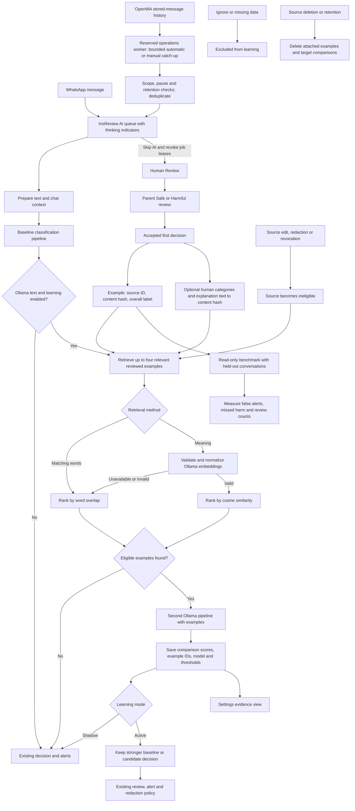

# Ollama learning architecture and implementation plan

See [the learning flow and training logic](LEARNING_FLOW.md) for the current
two-track design, Mermaid diagrams, privacy boundary and optional local LoRA commands.
The versioned synthetic pack is separate from private human reviews. It can be enabled in
Settings for Shadow comparisons, including targets without a private retrieval match.
The evaluation buttons queue aggregate-only synthetic or held-out conversation checks.
Neither evaluation automatically enables Active or publishes weights.

Ollama's weights stay unchanged. Iris improves the context supplied to Ollama using accepted
human reviews. Retrieval defaults to bounded Unicode word matching for Hebrew and English.
Optional semantic retrieval uses an installed embedding model through the configured Ollama server.
It stores no vectors or second copies of message content and downloads no models automatically.

## Shipped behavior

- IrisReview contains queued/running AI checks; Human Review excludes those checks. Each AI item
  has a thinking icon and a Skip AI action for parents/admins, with no Safe/Harmful controls.
  Skipping revokes every active check lease for that message, so late results cannot overwrite
  human decisions. Previously accepted decisions are preserved when skipping a recheck.
  Human actions appear directly, without the “Note: additional options” section.

- Settings → Classification → Moderation offers `Off` (default), `Shadow`, and `Active`.
  Off performs no additional inference. Shadow leaves baseline decisions and alerts unchanged.
  Active can escalate decisions, while preserving stronger baseline evidence; it does not
  automatically clear an existing harmful or inconclusive decision. A failed Active pass sends
  a non-harmful baseline to review. Failed Shadow passes are recorded without changing alerts.
- Accepted parent Safe/Harmful reviews capture eligible text automatically, including provider
  review buttons. Ignore, missing-data reports, images, audio, video, redacted/revoked sources,
  empty text, and sources or targets longer than 1,200 characters are excluded.
- Learning evidence lets an admin import existing eligible reviews, include/exclude examples,
  inspect comparisons, and follow links to source messages. Import processes at most 1,000
  not-yet-imported reviews per request and rejects messages edited after review. Repeated imports
  advance through batches; the API accepts an `after` message-ID cursor.
- Retrieval examines at most 200 recent examples and supplies at most four distinct exact
  source hashes. Word matching requires meaningful overlap (Jaccard ≥ 0.2). Hebrew vowel marks
  and cantillation are removed for matching; stored text and content hashes remain unchanged.
  All methods require unchanged source content,
  earlier message time, and exactly the same set of monitored child receipts. Skipped chats and
  missing-data reports are excluded. A target can never retrieve itself. This is lexical
  retrieval can miss synonyms and some Hebrew inflections.
- Choose **Find reviewed examples by → Meaning** to try semantic retrieval. Enter an installed
  multilingual embedding model name and use **Test embedding model** before saving. The cosine
  cutoff defaults to 0.7 as an experimental starting point, not a calibrated safety threshold.
  Eligible examples and the target are embedded in one bounded batch with a 30-second timeout;
  vectors must be finite, nonzero, complete and dimensionally consistent. No vectors are retained.
  Errors or missing configuration fall back to word matching. Evidence records the requested and
  actual method, embedding model, fallback reason, candidate count, and embedding/ranking latency.
  A fallback with no matches is recorded without changing the baseline decision. Redacted,
  cross-child, skipped-chat and held-out sources are filtered before any embedding request.
  Re-embedding each batch avoids stale retained vectors but adds compute cost; keep this opt-in
  until representative benchmarks justify enabling it. Identical content with contradictory
  labels in the candidate pool is excluded.
- Labels are overall Safe/Harmful decisions. Iris does not invent human category scores or
  treat Ignore as Safe. Examples are marked as untrusted data and never substituted for the
  target. Each request owns its examples; the shared Ollama client has no mutable example state.
- Human Review offers optional explicit harm categories and a reviewer explanation (up to
  1,000 characters, with automatic Hebrew/English text direction). Categories accompany only
  Harmful decisions; explanations can accompany Safe decisions too. The first accepted decision
  owns these details. They are tied to an exact source hash, shown in response history only
  while current, and supplied as untrusted guidance with eligible learning examples. Old reviews
  retain their overall verdict without invented details. Redaction/revocation clears details;
  deletion cascades the feedback, and audit logs retain only whether an explanation was present.
- Examples store IDs, hashes, and labels, not content. Deleting a source cascades its example;
  deleting a target cascades its comparisons. Redaction and edits invalidate retrieval immediately.
  Comparison records can retain now-deleted example IDs for provenance, but no example text.
  At most ten comparison runs are retained per target message.
- Admin APIs: `GET /api/learning/examples`, `POST /api/learning/examples/import`,
  `PATCH /api/learning/examples/{id}` with `{ "enabled": false }`, `GET /api/learning/runs`,
  and `DELETE /api/learning/runs` to clear comparison evidence.

## Evaluation and rollout

Installed locally on 2026-10-10 as `2026.10.0-beta.22`, schema `0017`. The deployed configuration
uses Shadow and lexical retrieval. No eligible reviewed text was available to import; learning
will start supplying examples after accepted eligible reviews exist. Real model/embedding checks
passed on synthetic input, but no accuracy estimate is available. The installed embedding model
is `mxbai-embed-large:latest`; its Hebrew retrieval quality has not been established. Do not enable
semantic retrieval merely because its connection test passes. Private backup, image, stack and
verification metadata are in `.local/learning-install-20261010`.

1. Import existing reviewed text, then choose Shadow and save settings.
2. Gather enough reviewed comparisons across Hebrew, English, slang, threats, jokes, and benign
   messages. Inspect disagreements and exclusions. Additional passes cost inference time.
3. Run `python -m app.classify.benchmark_learning --limit 30` inside Iris's configured Python
   environment. It reads the configured database, uses the configured Ollama endpoint, and prints
   aggregate JSON without changing stored messages, alerts, or model weights. It makes real
   Ollama requests. Whole conversations are assigned deterministically to a 20% test split;
   every test conversation is excluded from retrieved examples, including other test targets.
   Eligible reviewed targets without retrieval matches retain the baseline as their candidate;
   the output reports match coverage and embedding fallbacks. No targets means an empty result,
   not a success claim. Compare the same limit/model/settings using `--retrieval lexical` and
   `--retrieval semantic`; the split remains unchanged between runs. Generation failures are
   reported and excluded, so compare failure counts as well as scores. Model sampling and
   concurrent message changes can still affect comparison runs.
4. Measure baseline and candidate false positives, explicit Safe misses, and Review abstentions
   separately. Harmful detection rate includes harmful targets sent to Review in its denominator.
   UI summaries are bounded operational samples, not held-out estimates or category calibration.
   They include only unchanged targets reviewed after their comparison, so old labels are not
   silently applied to edited content or later rechecks.
   Because only uncertain/alerted messages tend to receive reviews, obtain representative benign
   and harmful labels before claiming overall accuracy.
5. Enable Active only after results justify additional alerts/reviews. Off is the immediate
   rollback. The shipped conservative policy prioritizes detection; reducing false alerts by
   overriding baseline harm requires a separately evaluated promotion policy.

## Next phases

1. Use the shipped optional category labels and explanations to gather reviewed examples;
   improve category definitions and curate contradictory examples.
2. Evaluate the shipped optional semantic retrieval against word matching. Add versioned
   persistent embeddings or caching only if quality and latency justify their storage cost;
   such a cache must preserve deletion, redaction, edit invalidation, and child isolation.
3. Add per-category evaluation, calibrated thresholds, latency reporting and representative
   sampling. Define acceptance thresholds from actual data before permitting baseline downgrades.
4. Fine-tune a supported model outside Ollama only if retrieval and prompt improvements leave a
   measured task gap. Import the trained model, benchmark it, and keep a model rollback path.
   Image learning requires its own examples, architecture, and benchmark.

No automatic model-weight updates, training on model-generated labels, external publication,
or automatic promotion of a candidate model are part of this release.

## Hebrew validation (2026-10-10)

`python -m app.classify.benchmark_hebrew --base-url <Ollama URL> --model mxbai-embed-large:latest`
checks six synthetic Hebrew paraphrases against near-topic distractors without reading the
database or changing settings. The installed model retrieved the intended example first in
3/6 cases, confusing support and exclusion and matching a gaming message to homework. This is
a small retrieval smoke check, not a safety-accuracy estimate or cutoff calibration. Keep lexical
retrieval and Shadow enabled; the semantic model needs a larger representative Hebrew benchmark
before promotion. Hebrew word matching now normalizes niqqud/cantillation (`lexical-v2`), while
preserving original content. Prefixes, inflections, synonyms and slang still need semantic evaluation.
